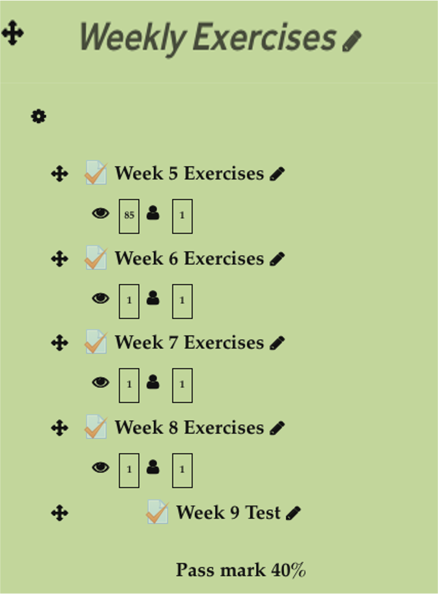

# Module Outline {.unnumbered}

## Preface {.unnumbered}

Employers such as firms and government agencies expect marketing graduates to a have good analytical thinking and basic numeracy skills. However, many of you might not have a high confidence when it comes to dealing with numbers. Anecdotal evidence shows that majority of marketing students choose the subject because "...they perceive a lower-level requirement of quantitative skills in marketing as compared to other business disciplines such as accounting, finance, and information technology" [@Ganesh2010, pp. 47]. This is in contrast to the high demand and expectation from employers for these skills for marketing graduates. We want to help you to meet the challenge and design this course. In return, we want you to be seriously engaged in this module.

## The Team {.unnumbered}

Module leader/tutor: [Ahmad Daryanto (Anto](https://sites.google.com/view/ahmaddaryanto)). Email a.daryanto\[at\]lancaster.ac.uk.

Tutor: Felix Martin. Email: f.martin\[at\]lancaster.ac.uk

## Learning Objectives {.unnumbered}

1.  To improve basic numeracy skills.

2.  To increase students' appreciation of the importance of gaining those skills in the marketing environment.

3.  As a preparation for advanced modules in Part 2.

## How to Study {.unnumbered}

Each section in this website relates to a particular topic. The section has a skeleton that includes `Problem`, `Watch`, and `Exercises`. Your learning journey on a topic will take the following routes described by this flowchart:

```{mermaid}
flowchart LR
  A[Problem] --> B{Solved it?}
  B --> D[Yes]
  D --> G[Watch Video]
  D --> F[Go to Exercises]
  B --> E[No]
  E --> G[Watch Video]
  G --> F[Do Exercises]
  F --> H[Attempt on Moodle]
```

## Program Structure {.unnumbered}

The module runs from week 5 - 9 in the Michaelmas term. In week 9, you take a test on Moodle during your workshop.

All workshop activities are conducted online. You must log onto **teams**. Your tutors are available virtually during workshop time. If you need any help, you can send a message or request to talk to your tutors.

During the workshops, you must attempt the weekly exercises. If you cannot finish them during the workshop, you must complete them outside of the workshop time and make sure they are finished before the next session the week after.

The structure of the program can be seen below.

| Week | Section |                        Topic                        | Exercises |
|:----------:|:----------:|:------------------------------------:|:----------:|
|  5   |    5    |             Arithmetic of whole numbers             |    20     |
|  6   |    6    |            Fraction and Decimal Numbers             |    10     |
|  7   |   7a    |                Percentage and Ratio                 |    tba    |
|  7   |   7b    |                 Exponents and Roots                 |    tba    |
|  8   |   8a    | Basic Marketing Math: Business Costs and Break-Even |    tba    |
|  8   |   8b    |    Basic Marketing Math: Market Share               |    tba    |
|  9   |   All   |                        Test                         |    20     |

## Exercises and Week 9 Test on Moodle {.unnumbered}

At the end of your journey (see flowchart), you must attempt the weekly exercises on Moodle. Direct links to the weekly exercises are given at the end of each page or alternatively you can log onto Moodle and visit the course page. Once you submit all your answers, you have completed the weekly topic.

{#fig-modex fig-align="center" width="25%"}

## Assessment {.unnumbered}

Exam or test will take place on Moodle in the last workshop of week 9. The exam will last for 40 min for 20 questions. The pass mark is 40%. If you fail, you will have a chance to take a resit -- the fails will be contacted by a module leader. The test link on Moodle for week 9 test is `password protected`. Your tutor will reveal the password in the workshop.

Make sure you don't miss out your examinations as they are mandatory for completion of your module.

## Textbook {.unnumbered}

**A textbook is not needed**. The information in this site is meant to be sufficient. But if you really want to buy a book, I recommend @Dar2020. This is a compilation book whereby its chapters are taken from @Croft2006 and @Berenson2012. The book had been used as a textbook of the module in previous years. It also contains chapters on basic statistics covered in MKTG200 Basic Statistics, which you will take in your second year. *Several copies of the book are available in the library*.

## Excel {.unnumbered}

I assume you know how to use `Excel` to calculate a basic mathematical operation e.g., 1+1. To answer certain problems in this manual, I provide `Excel` commands. This is a nice tool to use but also dangerous. Without an understanding, the use of `Excel` can put you in the dark forever. Make sure you understand how to manually solve the weekly problems/exercises before resorting to `Excel`.
