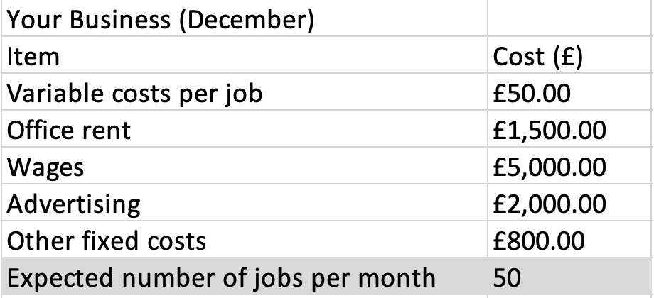
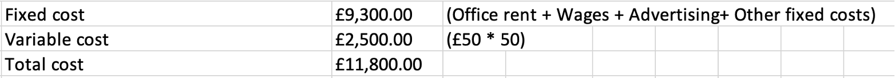

Solutions to weekly problems and exercises
---
title: "Solutions to weekly problems and exercises: Week 8a"
format:
  pdf:
    toc: true
    number-sections: true
    highlight-style: github
---


# Week 8a {.unnumbered}

## 1.2. Fixed cost and variable cost {.unnumbered}

**Problem**

The cost of making a one unit of a product is £40. What is the cost to make 20 units?

Answer:

£40 times 20 = £800

**Exercise**

Look at the table below.

{#fig-bep fig-align="center" width="60%"}

Calculate total cost.

Answer:

{fig-align="center" width="100%"}

## Break-even analysis {.unnumbered}

**Problem**

You sell a product with a price of £20 per unit. The variable cost of the product is £10 per unit. The fixed costs associated with the product is £20,000. How many products should you sell to achieve break-even?

*Answer:*

Fixed cost = £20000

Selling price = £20

Variable cost per product = £10

```{=tex}
\begin{align}

Contribution &= Selling \; Price - Variable \; Cost \\

&= £20 - £10 = £10

\end{align}
```
```{=tex}
\begin{align}

BE \; quantity &= \frac{Fixed \ cost}{Contribution} \\
&= \frac{£20000}{£10} \\
&= 2000

\end{align}
```
Thus, you should sell 2000 units.

**Exercises**

1.  A company's variable costs per product are £5. The daily fixed costs are £100. If the product is sold at £10, calculate the break-even quantity.

*Answer*

```{=tex}
\begin{align}

Contribution &= Selling \; Price - Variable \; Cost \\

&= £10 - £5 = £5

\end{align}
```
```{=tex}
\begin{align}

BE \; quantity &= \frac{Fixed \ cost}{Contribution} \\
&= \frac{£100}{£5} \\
&= 20

\end{align}
```
2.  If you increase the selling price by 5%, calculate the new break-even quantity.

*Answer*

New selling price = $105 \% \times £10 = 10.5$

```{=tex}
\begin{align}

Contribution &= Selling \; Price - Variable \; Cost \\

&= £10.5 - £5 = £5.5

\end{align}
```
```{=tex}
\begin{align}

BE \; quantity &= \frac{Fixed \ cost}{Contribution} \\
&= \frac{£100}{£5.5} \\
&= 18.18 

\end{align}
```
The BE quantity is 18.18. You can not sell partial units. You may round up to the next whole number (if you round down, you will incur a profit loss). Thus, you must sell at least 19 units.
