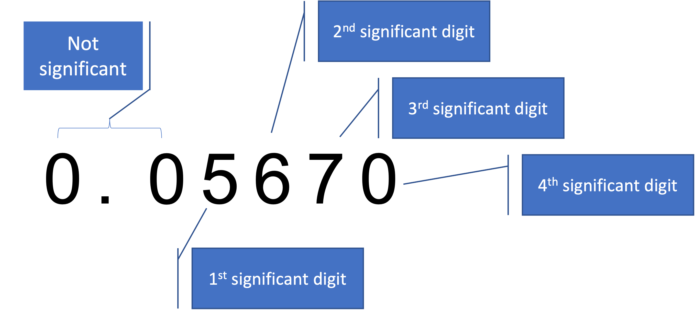
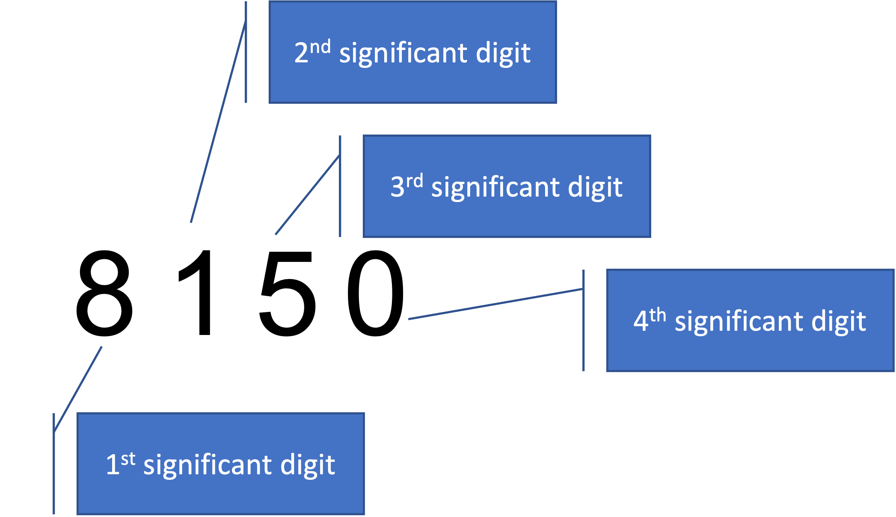

# Week 6: Fraction, Decimals, and Significant Figures

## Learning Goals

-   Understand fraction and decimal number
-   Understand rounding a number
-   Understand significant figures

## Fraction and Decimal Number

**Fraction**

$\frac{1}{2}$ and $\frac{4}{3}$ are fractions. The top number in a fraction is called `numerator`, and the bottom number is called `denominator`. $\frac{1}{2}$ is a proper fraction.

::: callout-important 
A proper fraction is a fraction in which the numerator is less than the denominator. 
:::

$\frac{4}{3}$ is not a proper fraction. We can write $\frac{4}{3}$ as $1 \frac{1}{3}$. The latter is a mixed fraction. A mixed fraction is a mix of a whole number and a proper fraction.

$\frac{2}{4}$ is a proper fraction because its numerator is less than the denominator. However, $\frac{2}{4}$ is not in its simplest form because it can be simplified as $\frac{1}{2}$.

**Decimal**

Decimal means a number based on 10. The word comes from Latin decima: a tenth part. 56.8 has 5 tens, 6 ones and 8 tenths. 

::: callout-warning

In the UK system, the decimal point is denoted by a `dot`. In other countries, the decimal point is denoted by a comma!

:::
### Problem

Express 0.142 as a proper fraction in its simplest form.

### Watch

<iframe width="560" height="315" src="https://www.youtube.com/embed/CA9XLJpQp3c" title="YouTube video player" frameborder="0" allow="accelerometer; autoplay; clipboard-write; encrypted-media; gyroscope; picture-in-picture" allowfullscreen>

</iframe>

<iframe width="560" height="315" src="https://www.youtube.com/embed/AtBUQH8Tkqc" title="YouTube video player" frameborder="0" allow="accelerometer; autoplay; clipboard-write; encrypted-media; gyroscope; picture-in-picture" allowfullscreen>

</iframe>

<iframe width="560" height="315" src="https://www.youtube.com/embed/Mst8iZjIpFE" title="YouTube video player" frameborder="0" allow="accelerometer; autoplay; clipboard-write; encrypted-media; gyroscope; picture-in-picture" allowfullscreen>

</iframe>

<iframe width="560" height="315" src="https://www.youtube.com/embed/qRL_taeUAPw" title="YouTube video player" frameborder="0" allow="accelerometer; autoplay; clipboard-write; encrypted-media; gyroscope; picture-in-picture" allowfullscreen>

</iframe>

### Exercises

1.  Express 0.015 as a proper fraction in its simplest form.

2.  Express 4.6 as a mixed fraction in its simplest form.

3.  Write $\frac{1}{100}+\frac{5}{1000}$ as a decimal number.

4.  Round 24.362 to 3 decimal places (3 dp).

5.  Round 0.0452 to 2 dp.

6.  In this fraction $\frac{1}{6}$, the numerator is ... and the denominator is ....

## Significant Figures

Significant means important. If I want you to report a number with 2 significant figures, it means the two digits in the number are important. 

Significant figures of a number relates to how we want to express the accuracy of the number. To decide how many significant figures we want to report, we count at the first non-zero digit. All the zeros **after the decimal point** that are on the right of the last non-zero digit are considered to be significant. For example, 0.05670 contains four significant digits; 8150 contains four significant figures.

{#fig-sif1 width="40%" fig-align="left"}

{#fig-sif2 width="40%" fig-align="left"}

### Problem

Write 76 to one significant figure (1 sf).

### Watch

<iframe width="560" height="315" src="https://www.youtube.com/embed/-X0amVzMKFo" title="YouTube video player" frameborder="0" allow="accelerometer; autoplay; clipboard-write; encrypted-media; gyroscope; picture-in-picture" allowfullscreen>

</iframe>

### Exercises

1.  Write 52 to three significant figure (3 sf).

2.  Write 35.572 to 3 sf.

3.  Write 0.0473 to 1 sf.

4.  Write 695.3 to 2 sf.

## Attempt the Exercises on Moodle

At this point, you would have worked on the above exercise questions.

Now, I want you to attempt these questions on Moodle.

Please click the link below:

[Week 6 Exercises on Moodle](https://modules.lancaster.ac.uk/mod/quiz/view.php?id=2012497)

Once you submit all your answers on Moodle, you complete your learning on this week's topic.
