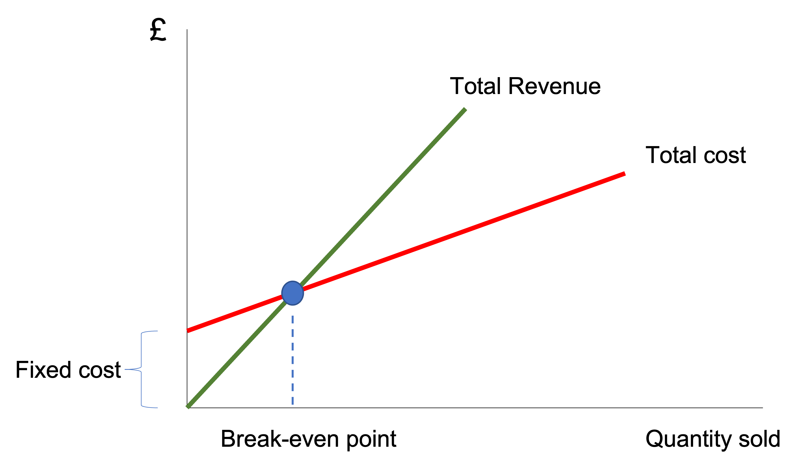

## Learning Goals

Know how to calculate

-   Fixed cost and variable cost
-   Break-even analysis
-   Profitability ratios


## Fixed cost and variable cost

Fixed costs are expenses that a firm must pay whatever amounts of products the firm sells. Examples of fixed cost are rent and advertising expenditure. 

Variable costs are expenses that varies in relation to how many products the firm sells. Examples of variable costs are delivery costs, packaging costs.

Total cost = Fixed Costs + Variable Costs $\times$ Outputs


### Problem

### Watch

<iframe width="560" height="315" src="https://www.youtube.com/embed/E7qWYu0xJfg" title="YouTube video player" frameborder="0" allow="accelerometer; autoplay; clipboard-write; encrypted-media; gyroscope; picture-in-picture" allowfullscreen></iframe>

### Exercises

Look at the table below.

Calculate total cost.

<!--#\captionof{table}{}  -->
```{r balance, message=FALSE, warning=FALSE, echo=FALSE, include=TRUE}
rm(list=ls())
library(readxl)
library(knitr)
library(kableExtra)
library(knitr)


dat <-read_excel("/Users/ahmaddaryanto/OneDrive - Lancaster University/numbook/data/balance.xlsx")

dat %>%
  kbl(caption = "Your Business (December)") %>%
  kable_classic(full_width = F, html_font = "Cambria")

```


## Break-even analysis

{#fig-bep width="60%" fig-align="left"}


### Problem
You sell a product with a price of £20 per unit. The variable cost of the product is £10 per unit. The fixed costs associated with the product is £20,000. How many products should you sell to achieve break-even?


### Watch

<iframe width="560" height="315" src="https://www.youtube.com/embed/vUT8lZLZpKg" title="YouTube video player" frameborder="0" allow="accelerometer; autoplay; clipboard-write; encrypted-media; gyroscope; picture-in-picture" allowfullscreen>

</iframe>

### Exercises

A company’s variable costs per product are £5. The daily fixed costs are £100. If the product is sold at £1, calculate the break-even quantity.

## Profit

### Problem

### Watch

<iframe width="560" height="315" src="https://www.youtube.com/embed/ROqkmlVuXKU" title="YouTube video player" frameborder="0" allow="accelerometer; autoplay; clipboard-write; encrypted-media; gyroscope; picture-in-picture" allowfullscreen>

</iframe>

### Exercises

